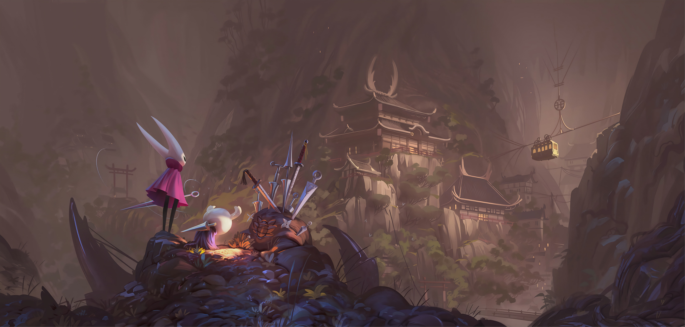
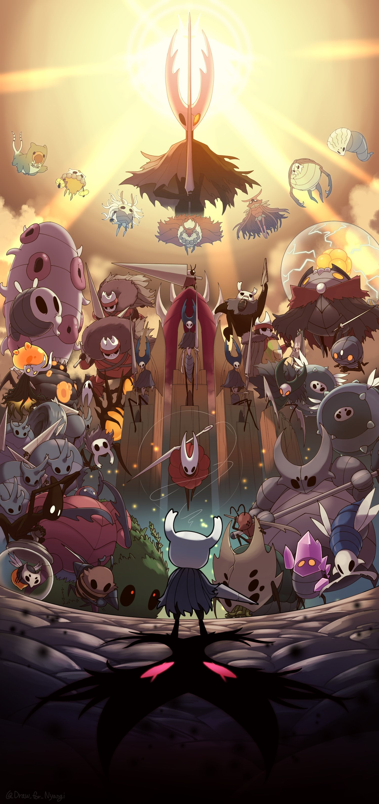

<!-- Banner -->

  

<h1 align="center">✨ Welcome, wanderer... ✨</h1>
<h3 align="center">Hi 👋, I'm T.K.Nguyen</h3>
<h4 align="center">"In the depths of code, I seek light like the Knight in Hallownest."</h4>

---

### 🌑 About Me
- 🔭 Currently working on **[Risc-V-Project](https://github.com/T-K-Nguyen/Risc-V-Project)**
- 🌱 Learning **React Native** and **Rust**
- 👨‍💻 My projects: [Repositories](https://github.com/T-K-Nguyen?tab=repositories)
- 📫 Reach me at: **thuankimnguyen2636@gmail.com**
- 📄 More about me: [LinkedIn](https://www.linkedin.com/in/thuan-nguyen-157624345/)

---
---

### 📂 Featured Repositories

  
  
  

### 🦋 Connect with Me

---

### ⚔️ Languages and Tools

  <!-- You already had icons; I just center them and keep dark aesthetic -->
   
   
   
   
   
   
   
   
  <!-- add others if needed -->

---

### 🏵️ GitHub Stats

  
  

---

  

⚔️ "The path ahead is perilous, but filled with growth." ⚔️

