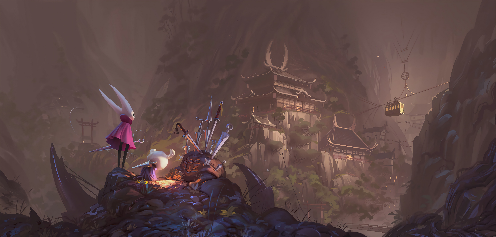
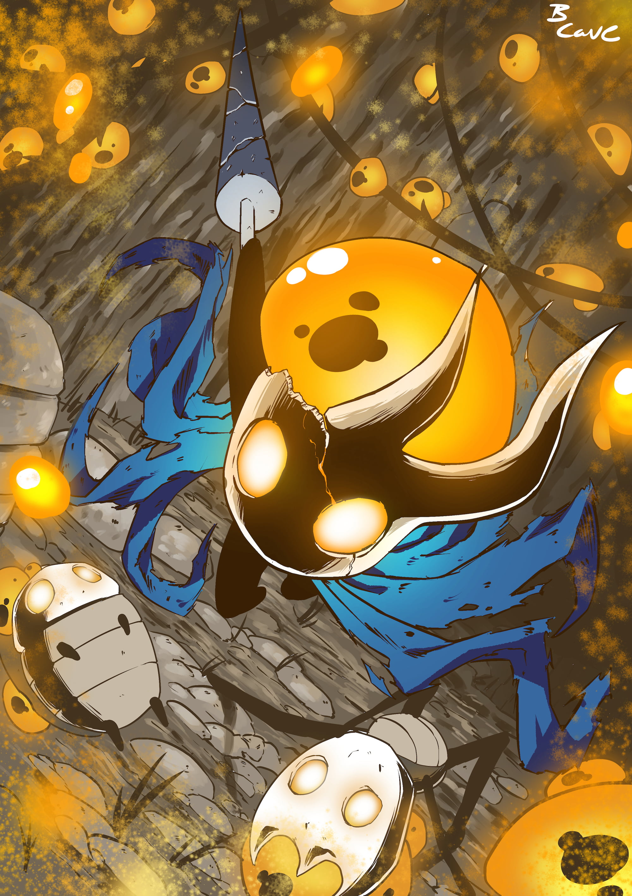
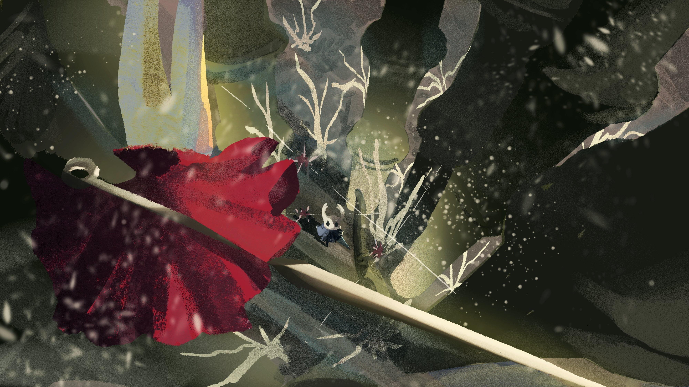
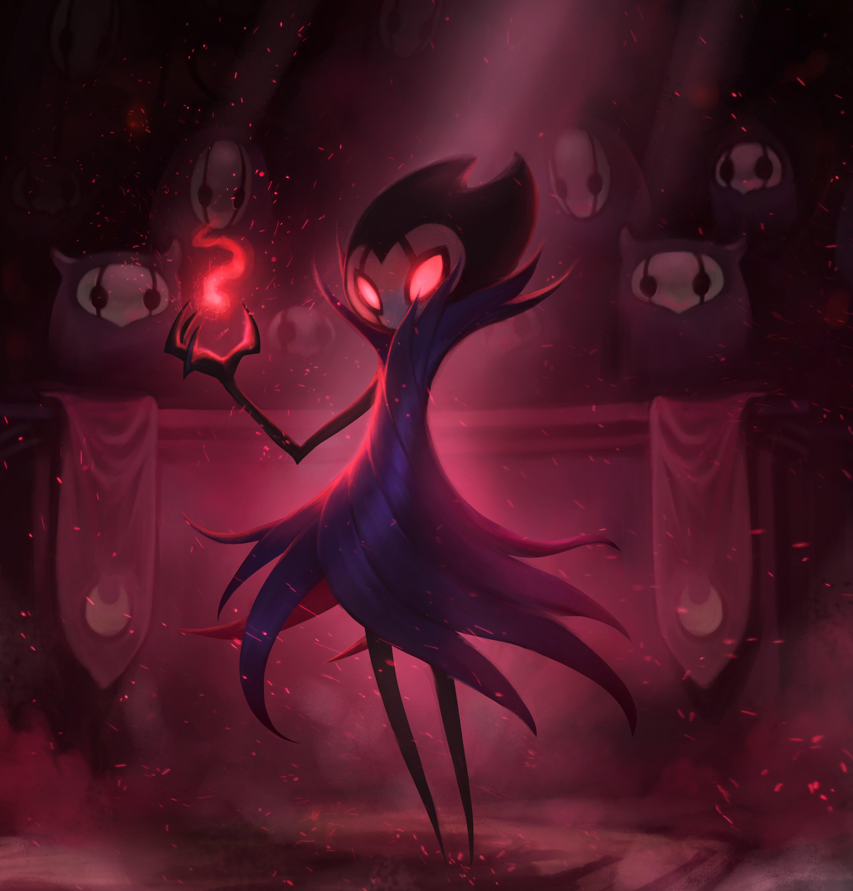
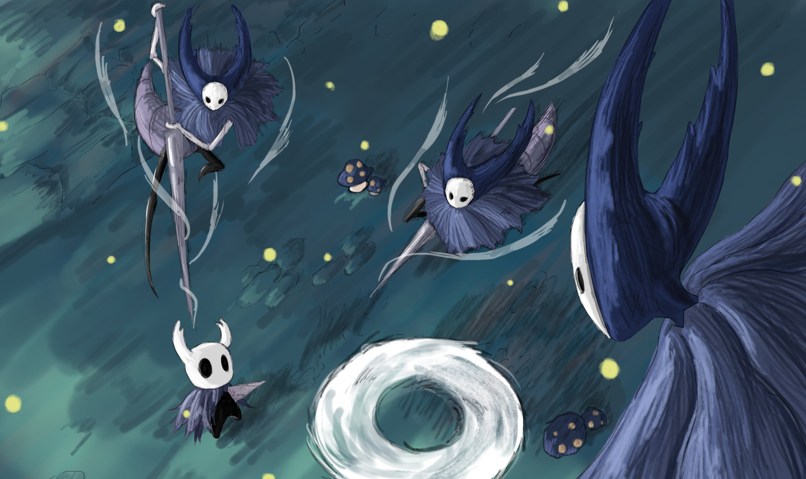
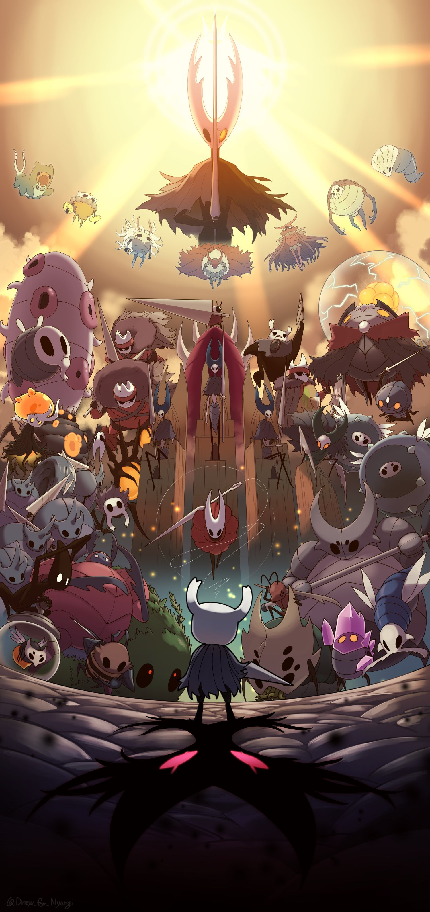

  

<h1 align="center">🌑 Welcome to the Depths, Wanderer. 🌑</h1>

  <em>"Forging light in the abyss of low-level systems and hardware architecture."</em>

  
  

---

### 🪲 The Developer's Lore

I am T.K. Nguyen—an embedded systems engineer who thrives in the intricate, unforgiving architecture of microcontrollers and wireless protocols. Like a Knight navigating the perilous depths of Hallownest, I specialize in pushing hardware to its absolute limits. From unearthing register-level anomalies to forging cryptographically fortified automotive access systems, I build order out of the void.

- 🎓 **The Foundation:** B.S. in Computer Engineering.
- ⚙️ **The Current Forge:** Embedded Engineering Intern architecting the future of smart car access via UWB and Channel Sounding.
- 🗣️ **The Voice:** 100% fluent in technical and business communication (TOEIC 875)—translating complex systems into clear strategies.
- 🛡️ **The Dark Arts:** Published researcher in cross-layer cybersecurity, weaving unified NFC, BLE, and UWB frameworks on commodity hardware.
- ⚔️ **The Pale Court:** Celebrating 100% completion in Silksong and maintaining the **[SmartCarAccess](https://github.com/T-K-Nguyen/SmartCarAccess)** ecosystem.

 

---

### 🛡️ Engineering Feats (Notable Projects)

**Hybrid Smart Car Access System**
Architected a secure, offline keyless entry system simulating a vehicle ECU using an ESP32-S3 microcontroller and a mobile app, entirely following the CCC 3.0 standard. Engineered NIST-compliant cryptographic protocols using mbedTLS to execute ECDH, ECDSA, and HMAC-SHA256, thwarting Man-In-The-Middle and Replay attacks. Researched and integrated lightweight TinyML edge models to analyze RSSI signal variance and mitigate physical relay attacks.

**IoT Environmental Monitoring & Control**
Built a concurrent, real-time cabin safety monitor using FreeRTOS Mutexes and Semaphores to achieve an event-driven architecture and eliminate CPU polling. Developed an I2C hot-plug auto-recovery algorithm to prevent bus deadlocks and ensure 100% system uptime during physical sensor disconnections.

**Smart Card Scanning System**
Developed STM32 firmware to interface with smart card readers, optimizing UART communication for reliable data transfer, and integrated an ESP32 module with Wi-Fi to enable remote monitoring.

 

---

### 📜 Tomes of Knowledge (Publications)

**[Beyond Relay Attacks: A Cross-Layer and Robustness Evaluation of CCC Digital Key Systems Utilizing NFC, BLE, and UWB](https://cse.hcmut.edu.vn/iaaa2026/index.html)**
*Accepted at IAAA'2026*
- Implemented a FreeRTOS state-machine enforcing sequential NFC provisioning, BLE authentication, and session-bound UWB DS-TWR ranging.
- Developed a novel hybrid Kalman-LSTM relay attack detector that achieved an outstanding F1-score of 0.94, outperforming standalone Kalman filtering by 36.2%.
- Evaluated an empirical single-anchor DS-TWR implementation, achieving a mean ranging latency of just 22.77 ms and 6.56 mJ energy consumption per cycle.

 

---

### 📂 Featured Relics 

  

  
  
  

---

### 🛠️ Arsenal & Charms 

  
  
  
  
 
  
  
 
  
  
  
  
 
  
  
  

---

### 📊 Hallownest Records 

  
  

---

  

<h3 align="center">⚔️ <em>"The path ahead is perilous, but filled with growth."</em> ⚔️</h3>
